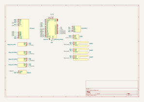
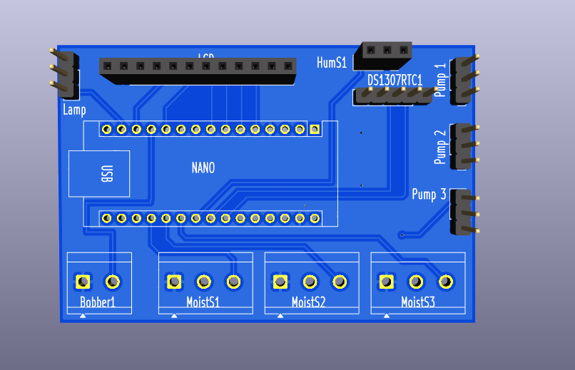

# Teplica_Scheme

Это плата для проекта [teplica2](https://github.com/ivy-goruden/teplica2). Проект представляет собой систему автоматизации для теплицы, управляемую микроконтроллером Arduino Nano.

Разработана в  KiCad

## Структура проекта

* `/Teplica`: Содержит файлы проекта KiCad (схема и печатная плата).
* `/components`: Библиотека символов компонентов для KiCad.
* `Teplica.svg`: Изображение схемы.
* `board.png`: 3D-вид печатной платы.

## Компоненты

Схема включает в себя следующие основные компоненты:

* **Микроконтроллер:** Arduino Nano
* **Часы реального времени:** DS1307
* **Датчики:**
  * Датчик влажности воздуха (HumS1)
  * 3 датчика влажности почвы (MoistS1, MoistS2, MoistS3)
  * Поплавковый датчик уровня жидкости (Bobber1)
* **Исполнительные устройства:**
  * 3 насоса (Pump 1, Pump 2, Pump 3)
  * Освещение (Lamp)
* **Интерфейс пользователя:**
  * LCD-дисплей

## Схема

## Внешний вид платы

